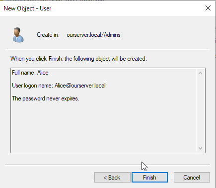
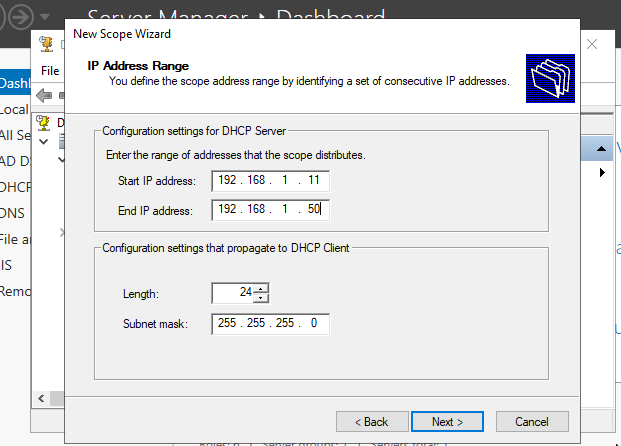

 

# I/ System preparation

For this project, I need to configure 3 virtual machines (client, windows server 2022 and a domain controller) using VirtualBox.
Since my machine has 8 CPUs and 16GB of RAM, I chose to run only 2 VMs; One for the client and one with the server and domain controller.

I will allocated ressources as follow:

-> Server + Domain Controller: 3 CPU, 6GB RAM

-> Client: 2 CPU, 4GB RAM

-> Local Machine: 3CPU, 6GB RAM

# II/ Active Directory setup

## A/ Add Roles and Features

* Once the installation is done, we get to the main menu of the server manager:

* Then click:

  * Add roles and features

  * Role-based or feature-based installation

## B/ Install Active Directory Domain Services (AD DS)

* And we select our own server:

  * Select server roles

  * Active Directory Domain Services

  * Add features

  * Click next until the instalation sumup

* Click install 

## C/ Promote the Server to a Domain Controller

* After closing the install window, go back to the dashboard and click on the flag

An then on "Promote this server to a domain controller"

* Int the deployment configuration window 
  * Add a new forest
Then enter a root domain name like "example.local" and click next.

* Leave the values to default but enter a Directory Services Restore Mode password.
* If prompted about DNS delegation, you can ignore it for now and click Next.

* As the NetBios Domain Name will be auto-generated based on your domain name, you can also click Next.

* Also click Next for the Path window 
* Review your selection and click Next
* The wizard will then make sure that all prerequisites are met and proceed to install.

## D/ Configure DNS service
* After completing restart, clik on "Tool" in the top right corner and select DNS.
* In DNS manager, expand the server node and check if the "forwrd lookup zones" folder contains our domain name (example.local).
If so, it shows the DNS is configured properly.

## E/ Create Organizational Units (OU)
* In Server Manager, click on "Tools" and select "Active Directory Users and Computers"
* Right-click on our domain name, select "new" and "Organizational Unit"

* Create two OU, one called "Admins" for Alice's profile and a second one called "StandarUsers" for Bob.

## F/ Confirm Domain Membership
* Navigate to "Settings", "System", "About", "advanced system settings".
* Under the "Computer name" tab, check for computer name and domain name. If it doesn't contain your example.local, you have to add it.

## F/ Configure Server Roles
* Install and configure IIS
  * Open Server manager. Click on "Manage", "Add roles and features" and follow the wizard to install Web Server IIS role.
  

# III/ Connecting Client and Server

## A/ Connect VMs

* Start both VMs.
* in cmd, run the following command:
  * -> ipconfig
  
* Check if both internal adapter (both VMs should have one) are on same subnet.
* Try to ping the server with the client.
  
Vms are connected.

## D/ Setup static IP for server's internal network adapter
* Go to "Control panel", "Network and internet", "Network and sharing center", "Change adapter settings".
* Right click on the internal network interface (ethernet 2 in this case)and select "Properties".
* select "internet protocol version 4", and click "Properties".
* 

## C/ Setup DHCP on server
* From the Server Manager dashboard go to "Manage", "Add roles and features", "Role based or feature based installation".
* Then select DHCP in the list and proceed to installation.

* Now let's configure the DHCP. In the server manager, click on the DHCP on the left. Then right click on the server and choose "DHCP manager".

* From this point unfold the server on the left, click on "ipv4" and on the right of the window click on "more actions". Then select "New scope".

* In the wizard, I call it "ClientNetwork".

# IV/ Join Client VM to the Domain
* So now we will take the same steps already taken at II/F with the server but on the client VM.
