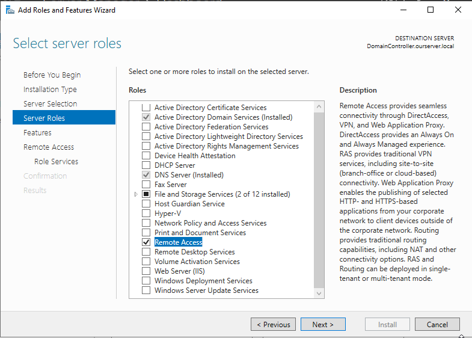
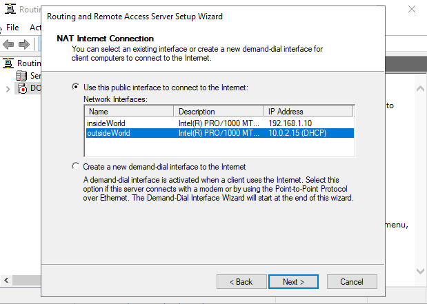
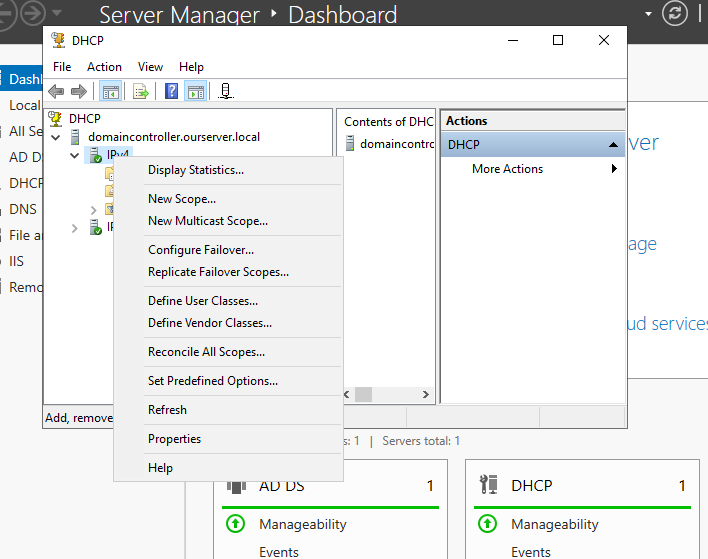
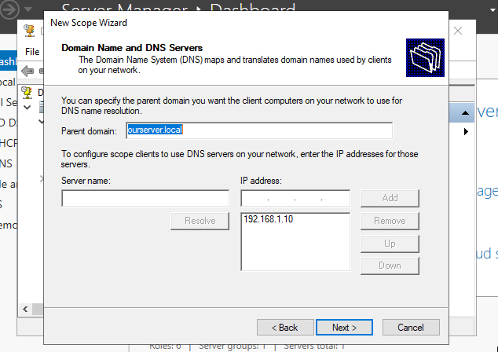
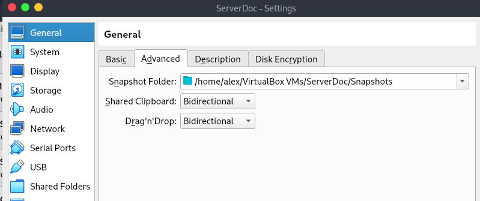
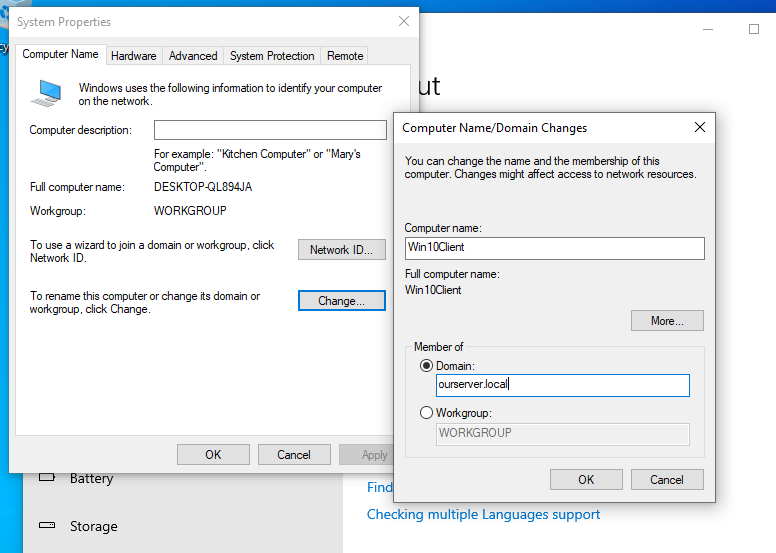
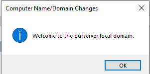

 
Source tutorial:
https://medium.com/@jzaager/how-to-install-active-directory-for-beginners-windows-server-2019-22920e99aa6c

# I/ System preparation (VM + Windows Server)

For this project, I need to configure 3 virtual machines (client, windows server 2022 and a domain controller) using VirtualBox.
Since my machine has 8 CPUs and 16GB of RAM, I chose to run only 2 VMs; One for the client and one with the server and domain controller.

I will allocated ressources as follow:

-> Server + Domain Controller: 3 CPU, 6GB RAM

-> Client: 2 CPU, 4GB RAM

-> Local Machine: 3CPU, 6GB RAM

* I'll first install the server VM and then the later on in this setup, the client.
* In the settings menu of my Server VM, I enable two network interfaces, one in NAT and a second one in Internal network.

# II/ Configuring Network Adapters and Setting a static IP address

* Got to "control panel" in the windows search bar and then select "Network and internet", "Network and sharing center", "Change adapter settings".
* Rename the adapter so then it is clear which one is for the internet and which one is for the intranet.

* Then right click on the internal adapter, "properties", "internet protocol version 4", "properties". Then we set up a static IP address and subnet mask. leave the default gateway empty and and enter 127.0.0.1 for "prefered DNS server".

* Back to the windows desktop, roght clik on the windows flag in the low left corner, "system", "rename this pc" and give it a clear name like "Domain Controller". This will restart your VM.

# III/ Installing Active Directory Domain Services (AD DS) and Creating a Domain

* From the Server manager dashboard, select "add roles and features". clikc "Next" until reaching a list and carefully select "Active directory domain services" and "add features" on the next window and proceed with the rest of the wizard.

* The click ont he flag and "promote this server to a domain controller", select "Add a new forest" and enter the root domain name you want. It will be "ourserver.local" in this case. Proceed with the rest of the install.

* Now go to "Tools", "Active directory users and computers", right click on your server and select "New", "Organizational Unit".

* We create two OU, one called "Admins" and the second called "StandardUsers". Then add Alice in the Admin OU and Bob in the second one.

* Select the "Admins" OU, right click it and go to "properties", "Member of" and hit "Add". Then enter "Domain Admins" and click "Check names", "apply".
To make sure this step was correctly done, you can logout of current user and try to log in with Alice or one of the new users.

# IV/ Configuring Network Address Translation (NAT)
-> This will Allow the client VM to connect to the internet through the Domain Controller

* Go to the task manager, "add new roles and features", and go to through the wizard while selecting "remote access" at the first selction screen. 

* On the next selection screen make sure to select "Direct access VPN" and "Routing" and proceed to install.

* Select "Tools", "Routing and remote access" and you should see your domain name in the left pane. Right click it and select "Configure routing and remote access".

* Select "Network address translation NAT" and then "Use this public interface to connect to the internet" and select the network interface that was intenteded for internet connection before clicking "Next".

* Ignore the firewall related error if so and proceed to install.

# V/ Setting up the Domain Controller as a DHCP server
-> Allowing the server to pass IP addresses to connected devices automatically.

* Let's go back to the "Add roles and features", select our server and select "DHCP server" in the list to install it.
* After install, close the "Configure remote access wizard" if such a window pops.
* There might also be an alert flag on the dash board. If so proceed to every step of the DHCP post-install wizard. 
* Got to "Tools", "DHCP", unfold the server on the left and right click the "ipv4" section to choose "New scope".

* You can name the scope as the ip address range for clarity(192.168.1.11-50), and do not set any IP reservation.

* Do not add any exclusion or reserved IP addresses and when asked proceed with standard option "I want to configure these options now".
For the lease you can leave it untouched but it depends on the business. for a cofee shop, the turnover is much faster so you might want to give it a way lower value tnan 8 days. 
* Now give the Domain Controller's IP address as the router IP. Click "Add".
* On the next windows you should see your server's name in the parent domain section, and it's ip address.

* For the next step you can ignore the WINS server and click "Activate the scope now".
* Once finisehd, go back to the DHCP window, right click on your domain controller and cick "Authorize" if not already.

# VI/ Setting up the Windows Client
-> Client: 2 CPU, 4GB RAM
* For this step, you'll have to create a new VM in you Hyperviser. Once it's done and before running it, go to "Settings", "General", "Advanced", and click to set "Shared clipboard" and "Drag'n'drop" as Bidirectional.

* Also, remember to set the network adapter as "Internal network", so then it can connect to the domain, use it as a DNS and get an IP assigned by DHCP.

# VII/ Installing Windows 10
* Chose the custom install.

* Go through the wizard and wait for it to complete.
* Once completed go tot he desktop and launch the CMD to use the "ifconfig" command and check if the client's IP address is withing the server's scope and if the domain name is mentioned.

* Now we can test if the DNS is functioning by using the "ping" command to a website.

# VIII/ Renaming the Windows 10 Client and Joining the Domain
* Right click the windows button and select "System", scroll down and click "rename this PC (advanced)". Chnage the member of section to "Domain" and enter domain name.

* Next enter a user name (Administrator) and password.

* Restart your VM.
* You should now be able to log in using another user from your Client VM.
