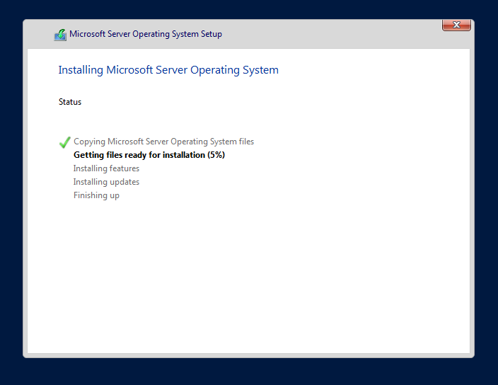
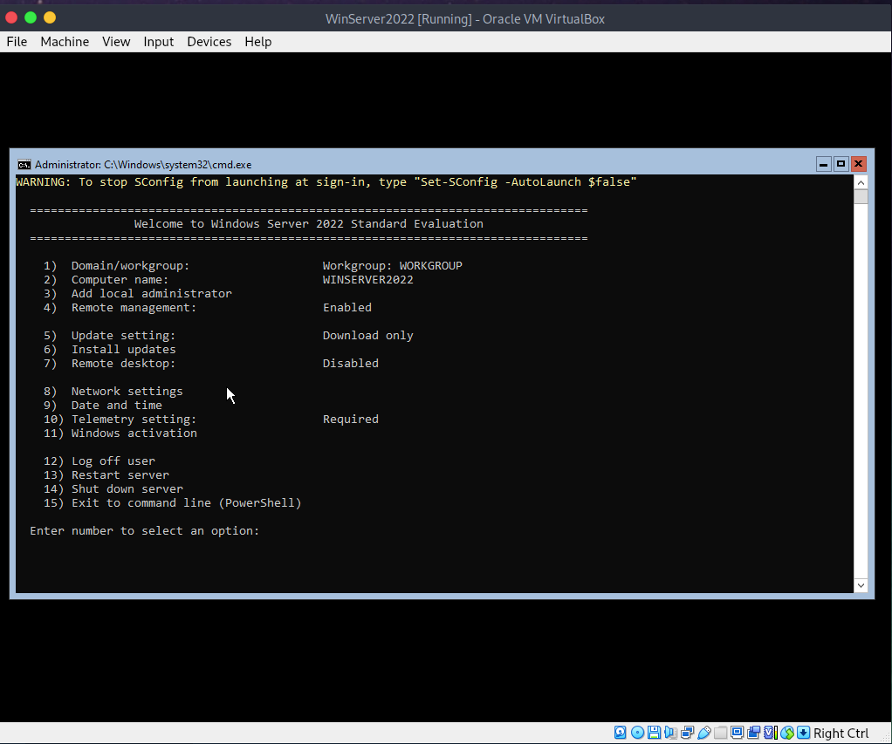
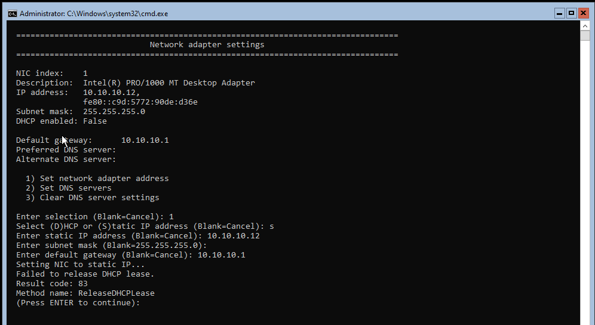
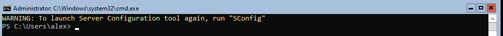
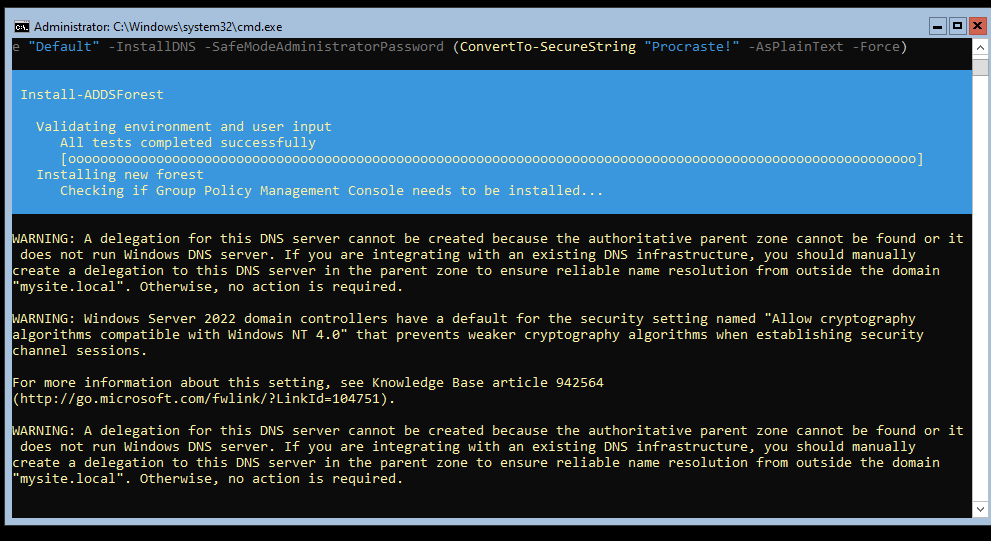
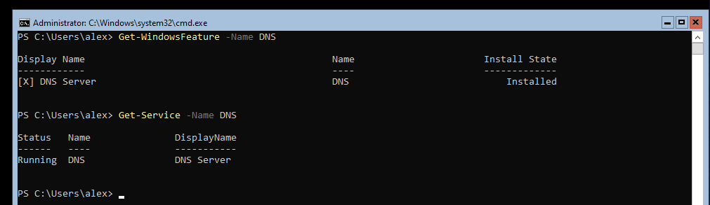

##### Windows Active Directory Project #####
 

For this project, I need to configure 3 virtual machines (client, windows server 2022 and a domain controller) using VirtualBox.
Since my machine has 8 CPUs and 16GB of RAM, I chose to run only 2 VMs; One for the client and one with the server and domain controller.

I will allocated ressources as follow:

* Server + Domain Controller: 3 CPU, 6GB RAM
* Client: 2 CPU, 4GB RAM
* Local MAchine: 3CPU, 6GB RAM

# I/ System Preparation

After the install is complete, we get to the main configuration menu. It is basically the command line version od server manager.

And configure the network settings.

Now that this is done, I'll promote the server to an active directory using powershell.

I enter in powershell using the  "powershell" command.

I used the following command since the keyboard layout was not the right one by default: 

> Set-WindowsUserLanguageList -LanguageList da-DK -Force

# II/ Active Directory Setup

Go through the install of Active Directory Domain Services Role:

> Install-WindowsFeature -Name AD-Domain-Services -IncludeManagementTools

And finally promoting the server to a domain controler:

> Install-ADDSForest -DomainName "example.local" -DomainNetbiosName "EXAMPLE" -ForestMode "Default" -DomainMode "Default" -InstallDNS -SafeModeAdministratorPassword (ConvertTo-SecureString "YourDSRMPasswordhere" -AsPlainText -Force)

> Restart-Computer

The Install-ADDSForest is supposed to configure the DNS by itself but we can make sure it is up and running:

 

2. Active Directory Setup

    Promote to Domain Controller:
        Open Server Manager and add the Active Directory Domain Services (AD DS) role.
        Promote the Server VM to a domain controller, creating a new forest and domain (e.g., example.local).

    Configure DNS:
        Ensure that the DNS service is installed and configured automatically during the AD DS promotion.
----------------------------------------------------
    Create Organizational Units (OUs):
        Open Active Directory Users and Computers (ADUC).
        Create OUs for user and group management (e.g., Admins, Users).
    Join Client VM to Domain:
        Change the Client VM’s network settings to use the Server VM as its DNS server.
        Join the Client VM to the domain (e.g., example.local).

3. User Management with Alice and Bob

    Create User Accounts:
        In ADUC, create user accounts for Alice and Bob:
            Alice: Assign to the Admins OU with administrative privileges.
            Bob: Assign to the Users OU with standard user privileges.
    Configure User Settings:
        Use Group Policy Objects (GPOs) to configure user settings based on their OUs.
    Set Permissions:
        Implement granular permissions for Alice and Bob based on security principles (e.g., folder access for Bob).

4. Server Roles

    4.1 Install and Configure IIS for Alice:
        Install the IIS role on the Server VM via Server Manager.
        Configure IIS for Alice’s specific web application/service.
        Apply security best practices (e.g., permissions, firewall rules).
        Test the web application to ensure accessibility for authorized users.

    4.2 Configure DNS:
        Verify DNS functionality within the Active Directory domain.
        Test DNS resolution for domain names and ensure proper functioning.
        Optionally, configure conditional forwarders for external DNS.

    4.3 Install and Configure DHCP:
        Install the DHCP role on the Server VM.
        Configure DHCP scopes for automatic IP assignment within the domain.
        Optionally, integrate DHCP with Active Directory for dynamic DNS updates.

5. Implement Sysmon for Monitoring

    Download and Install Sysmon:
        Download Sysmon from the Sysinternals Suite.
        Install Sysmon on the Server VM to monitor system activity.
    Configure Sysmon:
        Create a configuration file to specify what events to log.
        Start Sysmon with the configuration file.
    Analyze Sysmon Data:
        Use tools like Event Viewer or Log Parser to analyze Sysmon logs.
        Prepare a summary of findings to present to the client.

6. Demonstration and Documentation

    Demonstrate Functionality:
        Show the client how to manage users, access the web application, and monitor system activity.
    Document Configuration:
        Create documentation outlining the setup process, configurations, and any security measures implemented.
