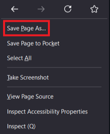
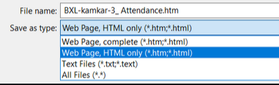
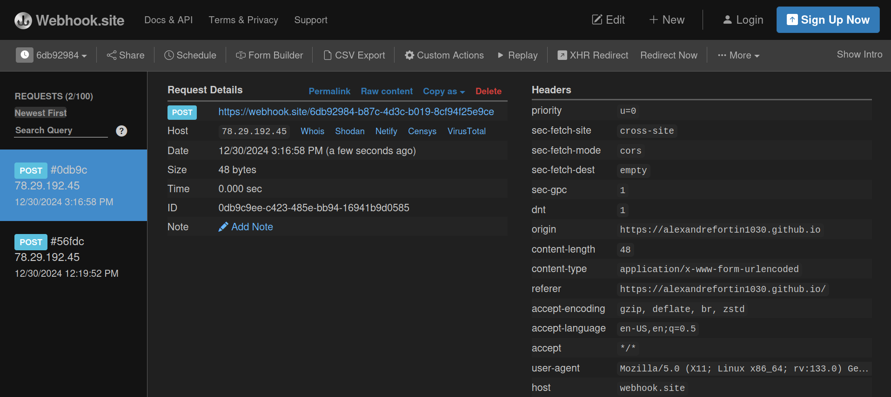
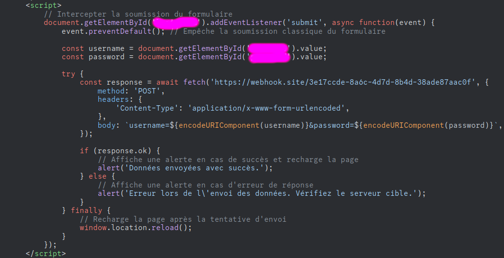

## Phishing

Phishing is a scamming technique on the Internet that involves tricking the user into believing they are communicating with a legitimate company (such as a bank, an online shopping site, or a social network) when in reality, they are providing their personal information (such as passwords, credit card numbers, or login credentials) to fraudsters.

#### I/ Copying a web page

For this project I decided to take the login web-page of a website called Moodle. The reason for this choice is no more that the fact it has two forms asking for a username and password values. For the record, some other login pages use more sofisticated tools and values to authenticate the user. Moreover, stealing credentials on lower security websites is often a winning strategy for malicious actors since most people use the same credentials for many websites.

For copying a webpage one only needs to right-click and save the whole code in html.

This way, when opening the document, it should be rendered as a browser would.

#### II/ Webhooks

For this project, we will use Webhooks.site which is free and give you an url that we will be using in our script.

 Once the webhook url is incorporated in our javascript in the "response", it will serve as an interface to collect an view the intercepted POST request.
 Bellow is the script with the response that has been modified with the webhook url as well as the pink parts that must be filled with the corresponding IDs of the copied html file.

 
 
Once the victim submits their credentials on the fake page, it is intercepted by the webhook.site and visible on it's interface. 
Inside the body's request, we can see the victim's credentials.
See in "form value" in the bottom right side of the picture.

