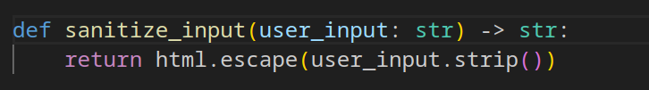
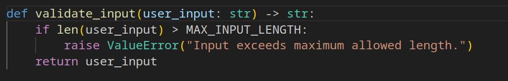
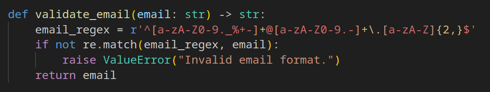

# Flask secure back-end
 
 #### Flask is a lightweight python framework designed for web developement. The idea behind this project is to design a secure back-end for the "comment section" of a website. This sections takes a few informations such as name, surname, email and message and sends it to the server. It has therefore to implement validation and sanitization mechanisms in order for it to be secure.

 ## Classic Back-end vulnerabilities
 The whole project is a simple flask backend that manages GET and POST requests from the client. As such and especially because of the POST requests, there is a risk of code injection.

 ## Security mechanisms implemented
 The security implement has been focusing on input sanitization an validation as well as the use of a secret-key to prevent alteration of session cookies.
 Getting a bit further into technicalities, we will discuss breifly the following two functions:

### Sanitization
  

- This function gets a string as an input and gives back a string as an output.
- It strips whitespaces fron the user input so then it prevents unexpected behavior such as validation or data storage fail.
- Most importantly, it escapes HTML special charachters by changinf them into their corresponding html equivalents. for example, '<' and '>' which are very sensitive in html becode respectiveley '&lt;' and '&gt;' which become inactive.

### Validation

  

  This second function is about validation after the input has been sanitized.

- This function also gets a string as an input and gives back a string as an output.
- Ckecks th length of the imput to prevent potential buffer overflows and Data integrity(The data stays manageable).
- Raises an error if the input does not meet the requirements.

### Mail Validation

  

This last function follows the same logic as the first one but is design to handle emails and uses Regular expressions for it.

#### All the user input that transit from a form go through sanitization first and validation afterwards. The data can then be safely stored in databases.

As an addition to the project, one could implement a honeypot in the form of an invisible form for the human eye that would be filled by bots and therefore rejected. That would limit spam and server ressource consumption.