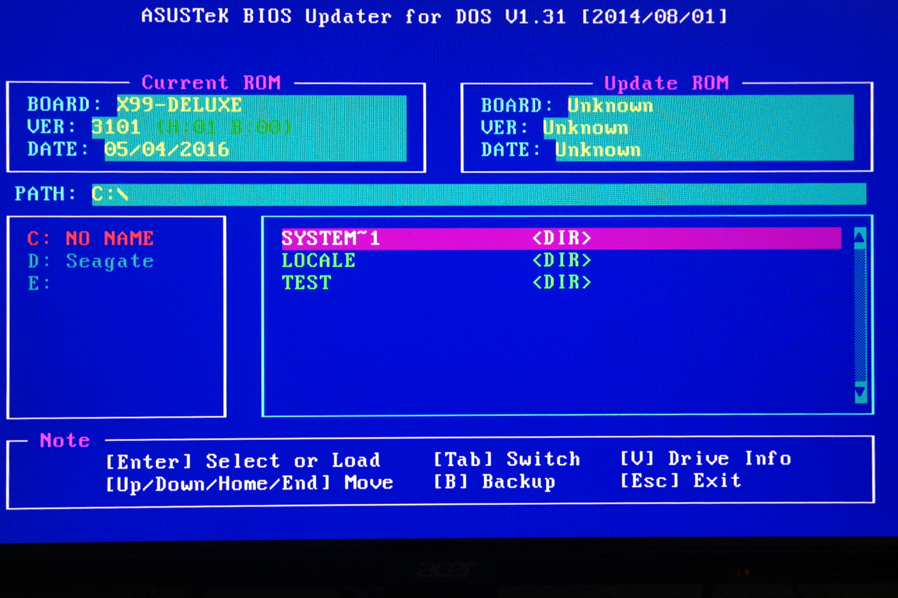
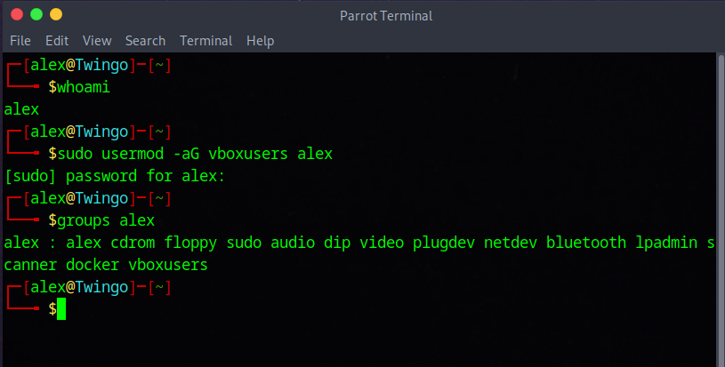
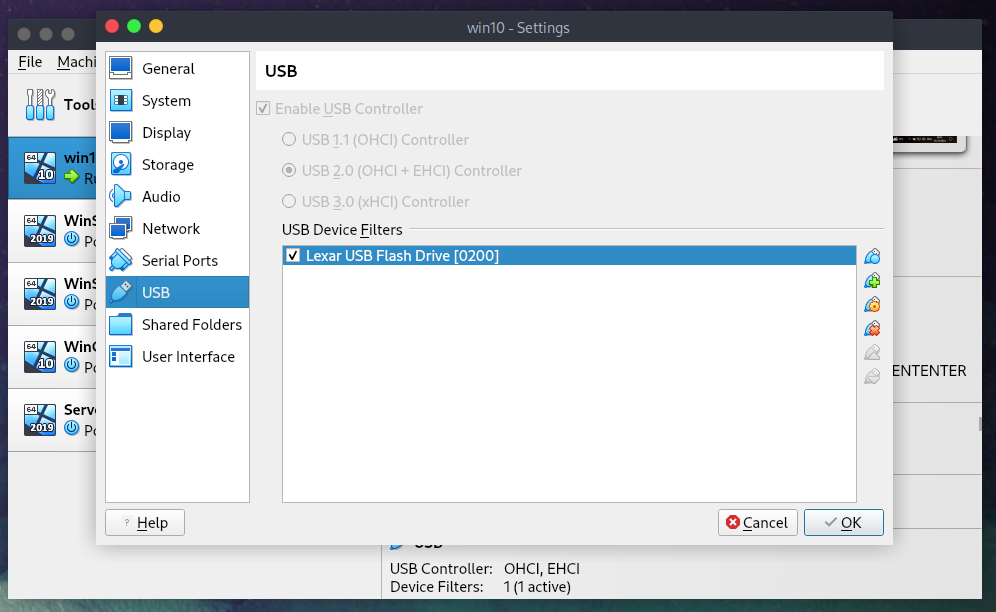

# Updating HP Bios on Linux OS

---> The process of updating an HP bios consists in  installing a newer version of BIOS firmware that controls the hardware initialization and communication between your operating system and hardware components. This process typically ensures better system stability, security, and compatibility with newer hardware or software.
The necessary steps to perform such update are downloading an .exe file from HP's website, create a bootable usb with it.
However, this pretty straight foreward process only works if the host's OS is windows, and in my case, it is a GNU/linux. As a sort of practice, I'll use a virtual machine with a usb drive mounted onto in order to handle the .exe file.

# I/ Mount Physical USB Drives on Virtualbox VMs
* A/ VirtualBox extension
To do so, I downloaded and lauched a virtualBox extension pack from their official website.
Then I run into an error that pointed to a new step: "VirtualBox is not currently allowed to access USB devices. You can change this by adding your user to the 'vboxusers' group. Please see the user manual for a more detailed explanation." 
* B/ Change user's group
Make sure of which user you are by using the "whoami" command and add the user into the vboxuser group with the following command:  
-> sudo usermod -aG vboxusers <yourusername>
* Verity if the command worked:  
-> groups <yourusername>

* go to virtualbox's main menu, click your VM and got to "Settings", "USB". Then select the usb type (1, 2 or 3), click on "Add USB filter" ans select your volume.

* Then you should be good to go.

# II/ Get the Firmware from HP
 

