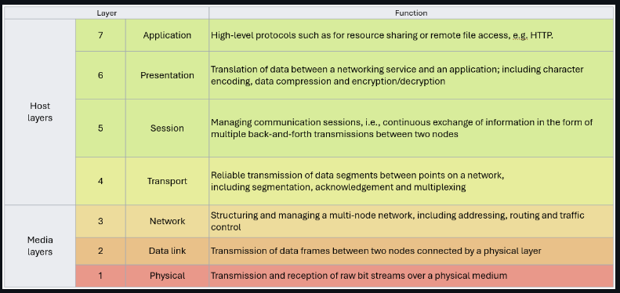

# Notes for SC-900 Certification

## I/ Describe Security and Compliance Concepts
-> Intro: As more and more businesses data is accessed from outside of the primary coporate network, security and compliance have become increasingly important.

## A/ Shared responsability model
In organization that are using cloud based services, the responsability of securing data access is shared between the company and the cloud provider. On the contrary, copanies that are running their own hardware are 100% reponsible for their own security and compliance.
The shared security model shows what aspects of these responsabilities are held by the client and which by the service provider.Obviously, this depends on the kind of service that is being provided:

SaaS: Software as a service
PaaS: Platform as a Service
IaaS: Infrastucture as a service
On-premises datacenter : Hardware is localy managed.

## B/ Describe defence in depth 
Defence in depth uses a layered approach to security, so then if one of these layers is breached, there's the next one to slow down or stop the attacker. 

#### CIA triangle

* Confidentiality, is keeping the data confidential.
* Integrity, is keeping the data unchanged or unaltered, making sure it remains as it is since the begining.
* Availability, refers to data being available or accessible whenever needed.

->Non repudiation: It ensures that no party can deny that it sent or received a message.

## C/ Describe Zero Trust model
-> Zero trust model always assumes the worst scenario."Trust no-one, verify everything".
* The following principles are emphasized:
   * Verify identity: Authentication and authorization are rigorously applied to all users and devices.
   * Least priviledge principle
   * Micro-segmentation: Network ressources are divided into smaller segments to limit lateral movement.
   * Continuous monitoring
   * Data encryption
   * Strict access control: based on context (user roles, device health, network location)

## D/ Common  threats
* Threat = Any potential danger:

    Phising, Malware, SQL injection, XSS ...

* Vulnerability = A soft/weak spot in the defence infrastructure.
* Risk = Threat combined with vulnerability.

####  MITRE ATT&CK framework:
-> A framework develloped by MITRE that provides a standardized way to describe and analyze cyber threats.
* Understanding Adversarial Behavior.
* Plan and implement defence strategies.
* Incident response and threat hunting.

## E/ Understanding risk management
* Threat = Any potential danger.
* Threat agent = malicious entity
* Vulnerability = A soft spot in the defence infrastructure.
* Risk = The potential for loss or damage resulting from the combination of threat and vulnerability.
* Asset = Anything of value.
* Exposure = The state of being vulnerabe to potential threats.
* Control = A mesure put in place to reduce the risk associated with vulnerabilities and threats.

#### Types of security controls:

* Administrative controls:
   * Security policies
   * Security awareness and training
   * Incident response management

* Technical controls:
   * Access control: restrict user access to ressources based on their roles and permissions.
   * Encryption: converting data into a secure format
   * Firewalls: network security devices that filters traffic
   * Intrusion Detection and Prevention Systems IDPS: Tools that monitor network traffic for suspicious activity.
   * Antivirus/Anti-malware software: Programs that detects and removes malicious softwares.
   * Authentication mechanism: method for verifying identity of a user.
   * Patch management: Regularly updating software to address known vulnerabilities.

* Physical controls:
   * Security guards
   * Surveillance cameras
   * Locks and physical barriers

* Legal and regulatory controls:
   * Data protection regulations
   * Industry-specific standrads

#### Assessing security risks
* Identify Assets and threats
* Assess vulnerabilities
* Likelyhood assessment
* Impact assessment
* Risk calculation
* Risk treatment
* Continuous monitoring and review

## F/ Security practices and documentation
* Security policy: A high-level document that outlines an organizations security goals, principles and guidelines.
* Security standards: A more detailed and specific document that provides guidelines and requirement for implementing security comtrols and measures within an organization.
* Security baseline: A set of minimum security config that is considered essential for a particular system.
* Security guideline: A document that deals with "grey area" when no standards apply to a specific situation.
* Security procedure: A detailed step by step guide of actions to apply.
* Laws and regulations: legal security frameworks established by governments and regulatory bodies.

## II/ IAM 

## A/ Key concepts:
#### Identity and access management (IAM)
* A set of proccesses, techs and policies that aims to make sure that the right individuals have the appropriate access to ressources within an organization's digital environnement. It aims to enhance security as well as streamline user access.

#### Principle of least priviledge
* Granting users and systems only the minimum priviledges necessary to perform the tasks they are intended to.

#### Segregation of duties
* distrubuting critical tasks and rsponsabilities in a way that prevent conflicts of interest and fraud

#### Authentication and authorization
* Authentication is verifying the identity of a user, system or entity trying to access a ressource. it can be based on something you know, something you have, something you are.

* Authorization is the process of granting or denying permissions or priviledges to and authenticated user or entity.

## B/ Zero trust architecture:
-> Identity is a key part of implmenting a zero trucst architecture and building a perimeter far any IT environnement.

#### Why Identity as a perimeter?
In modern IT environments, especially since the rise of cloud services and remote work, the traditional security perimeter (doors, firewalls etc) is no longer the go to. Instead security nowadays revolves around  verifying and managing the identity of users, devices and applications attempting to access ressources, regardless of their physical location.

#### Differences with traditionnal architectures:

#### Identity used ti implement zero trust architecture:
* In a zero trust architecture, the fundamental principle is to nerver automatically trust any entity, regardless of wether it is inside or outside the network perimeter. This involves verifying their digital identity through methods such as username/password combo, MFA, biometrics and other strong authentication methods.

## C/ Capabilities :
-> Core tools and capabilities used in identity security.

#### Directory service
A directory service is a database that stores and manages information about network ressources including users, groups, devices, apps... It is used as a central repository of identity and access related data. It provides a foundation for Identity and Access Management solutions (IAM).
Key featurures:
* User authentication: Directory services validate user credentials to ensure only authorized users can access the networks and its ressources.
* User Authorization: Determines the level of access each user has according to their roles, group membership and other attributes.
* Group management: Permissions can be assigned to groups rather that only to individual users.
* Password policies: Enforcing password complexity and expiration rules.
* Single Sign-on(SSO):Enables users to access multple applications and services through a single set of credentials.
* Centralized user management
* Auditing and logging

#### Capabilities that can be used to secure identities?
* MFA
* Single Sign-on (SSO): reduces the risk of managing multiple passwords.
* Role based access control: Users are granted access based on their roles within an organization.
* Adaptive authentication: Adjusts dynamically the level of authentication required based on the user's behavior, location, device etc.
* Biometric authentication
* Priviledged Access Management: Focuses on securing access to critical systems and data with Just-In-Time access and session monitoring.
* Behavioral Analitycs: Monitors user's behavior and establishes baseline patterns. Deviation from the norm can trigger alerts for further inverstigations.

## III/ Networking

## A/ IP addressing.
Numerical value assigned to every computer connected to a network and using the internet protocol.
## B/ OSI Model
The OSI model is a conceptual framework that standardizes the fucntions of a communication system into seven disctinct layers.
1. Physical layer
2. Data link layer
3. Network layer
4. Transport layer
5. Session layer
6. Presentation layer
7. Application layer

## C/ TCP/UDP
-> Two fundamental transport layer protocol (4).

#### TCP - Transmission Control Protocol
* Connection oriented protocol that provides reliable and ordered data delivery between devices. (3 way handshake, segmentation and reassembly, retransmission, ACK...)

#### UDP - User Datagram Protocol
* Connectionless protocol that provides faster data transfert but does not provide the same level of reliability as TCP. No formal connexion before sending data, no ACK or retransmission mechanism.

## D/ Port numbers
* An unsigned integer used to diffrentiate in between different services or applications that are running on a single device within a network. Ports help route incoming data to the appropriate application.

## E/ Encryption
#### At rest:
Involves encrypting data that is stored on a device, servers, or storage systems. Even if an attacker gains physical access to the storage media, they cannot acces the adata without the encryption key.

#### In transit:
Involves encrypting data as it travels in between devices or over networks. This prevents eavesdropping (interception). Common protocols are https, TLS/SSL.

## IV/ SecOps
-> A team devoted to the task of protecting the CIA of an organization's assets.
#### Different forms it can take:

* Security Operation Center (SOC): Central team monitoring, analysing, and ready to respond to security events 24/7.

* Incident response team: specialized team dedicated to responding to security incidents and breaches.

* Threat hunting: a team that searches for advanced threats and hidden vulnerabilities that may not be detected by standard tools.

* Red/Blue team

* Managed Security Services Provider: Some companies outsource security task to third-party providers specialized in security mnitoring and incident response.

#### How it differs from traditionnal IT operations:

* Focus: SecOps are dedicated to security and not managing all aspects of the IT ecosytem. 

* Skillset: SecOps requires very specific skills

## V/  AppSec
-> Refers to the practice of protecting software applications from security threats, vulnerabilities and attacks. It encompasses the processes, techniques, and tools used to identify mitigate and prevent security risks throughout the development, deployment and maintenance life cycle of an application.

## A/ Some key concepts:

* Secure by design
* Input validation/sanitization
* Output encoding
* Authentication and authorization
* Data protection
* Secure dependencies
* Security testing

## B/ Key capabilities and tools:
-> Application security key capabilities and tools are essential for identifying, mitigating and preventing security vulnerabilities and threats.

* Static Application Security Testing:
Analyses source code to identify security vulnerabilitie in the app's codebase.

* Dynamic Application Security testing:
Scans a running app by sending input requests and analyzing responses.

* Interactice Application Security testing:
Combo of both previous to nalyse the app during runtime.

* Runtime Application Security testing:
Monitors and protects app in real-time, detecting and responding to security threats as they occur.

* Penetration testing
Real world attack simulations to discover vulnerability and train.

## VI/ Infrastucture security
-> Infrastructures refers here to the foundational components that support the operation and management of IT services and applications. It includes physical ressources such as servers and networking equipment as well as virtual ressources like cloud services (azure or AWS) and containers (Docker, Kubernetes).

## A/ Key concepts:

#### Security hygiene
-> A set of practices and behaviors to follow that aims to maintain good cybersecurity habits.

#### Security posture management
-> Refers to the practice of Assessing an organization's cyber security posture (overall approach and readiness to protect its assets from cyber threats and maintain its confidentiality, availability and integrity).

#### Patching
-> Refers to the process of applying software updates.

#### What are containers
->Containers are a form of lightweight and executable software package that contains everything needed to run a piece of software. It provides a conssistent and isolated evironement for application. Making it easier to develop, package and deploy software accross different environments and platforms. Container security is crutial because they introduce potential security challenges.

*  Image security:
Ensuring that container images are free from vulnerability.

* Runtime security:
Protecting running containers through isolation and monitoring to prevent unauthorized access and attacks.

* Access control:
Controlling who can access and modify containers by impementing role-based access control and identity management.

## B/ Capabilities and tools:

#### What is Vulnerability Management?
-> Vulnerability management is a systematic process of identifying, evaluating, priorizing, mitigating and monitoring vulnerabilities in computer systems, software, network and infrastructure.

#### What is CSPM ?
-> Cloud Security Posture Management is a set of tools, processes and practices designed to assess, monitor and enforce security configurations and best practices in cloud environment.
* Configuration assessement
* Security policy enforcement
* Continuous monitoring
* Compliance reporting 

#### What is CNAPP ?
-> Cloud-Native Application Protection Platform.It is an all included cloud-native software platform that simplifies monitoring, detecting and acting on potential security threats and vulnerabilities.

## VII/ Data security
-> Data security is the practice of protecting digital data (databases, files etc) from unauthorized access, disclosure, alteration etc...

## A/ Key concepts

#### Data classification
Is a process that aims to classify data according to it's level of sensitivity. It helps understand which data should benefit from higher level of care and protection.
ex: Public, Internal, Confidential, restricted, etc. 

#### Data lifecycle management
Is a strctured approach to managin data through it's entire lifecycle. From it's creation, storage, eventual processing, archival and deletion. It involves defining relevant policies and procedures according to the current stage of data's life cycle.

#### Data Loss Prevention (DLP)
DLP uses content inspection and contextual analysis to monitor and control data in motion, at rest or in use. It aims to identify and block or encrypt sensitive data to prevent data breaches or leakages.

#### Why is data security important for an organization ?

* Protection of sensistive information
* Prevention of data breaches
* Preservation of trust (from customers and stakeholders)
* Protection against insider threats

## B/ Data security capabilities

## VIII/ AI security
